# Especificação UML — Sistema de Reserva de Hotel

Este documento contém o modelo conceitual, diagramas estáticos de classes individuais separados por blocos temáticos (`Models` e `Services`), diagramas dinâmicos de transição de estados e o detalhamento técnico do sistema de reservas.

---

## 📑 Sumário

* **[1. Bloco Temático: Models (`src/models/`)](#1-bloco-temático-models-srcmodels)**
  * **[1.1. Enumerações e Constantes (`Enums`)](#11-enumerações-e-constantes-enums)**
    * [TipoQuarto](#enum-tipoquarto)
    * [StatusQuarto](#enum-statusquarto)
    * [StatusReserva](#enum-statusreserva)
    * [OrigemReserva](#enum-origemreserva)
    * [MetodoPagamento](#enum-metodopagamento)
  * **[1.2. Comportamentos Transversais (`src/models/mixins.py`)](#12-comportamentos-transversais-srcmodelsmixinspy)**
    * [Classe `AuditoriaMixin`](#classe-auditoriamixin)
    * [Classe `SerializavelMixin`](#classe-serializavelmixin)
  * **[1.3. Hierarquia de Pessoas (`src/models/pessoa.py`)](#13-hierarquia-de-pessoas-srcmodelspessoapy)**
    * [Classe `Pessoa` (Abstrata)](#classe-pessoa)
    * [Classe `Hospede`](#classe-hospede)
  * **[1.4. Hierarquia de Quartos (`src/models/quarto.py`)](#14-hierarquia-de-quartos-srcmodelsquartopy)**
    * [Classe `Quarto` (Abstrata)](#classe-quarto)
    * [Classe `QuartoSimples`](#classe-quartosimples)
    * [Classe `QuartoDuplo`](#classe-quartoduplo)
    * [Classe `QuartoLuxo`](#classe-quartoluxo)
  * **[1.5. Reservas, Pagamentos e Adicionais (`src/models/reserva.py`)](#15-reservas-pagamentos-e-adicionais-srcmodelsreservapy)**
    * [Classe `Reserva`](#classe-reserva)
    * [Classe `Pagamento`](#classe-pagamento)
    * [Classe `Adicional`](#classe-adicional)
  * **[1.6. Hierarquia de Exceções de Domínio (`src/models/exceptions.py`)](#16-hierarquia-de-exceções-de-domínio-srcmodelsexceptionspy)**
    * [Classe `HotelException` e Subclasses](#classe-hotelexception-e-subclasses)
* **[2. Bloco Temático: Services (`src/services/`)](#2-bloco-temático-services-srcservices)**
  * **[2.1. Orquestração Central (`src/services/hotel.py`)](#21-orquestração-central-srcserviceshotelpy)**
    * [Classe `Hotel`](#classe-hotel)
  * **[2.2. Cálculo de Tarifas (`src/services/tarifas.py`)](#22-cálculo-de-tarifas-srcservicestarifaspy)**
    * [Classe `CalculadoraTarifa`](#classe-calculadoratarifa)
  * **[2.3. Relatórios e Indicadores (`src/services/relatorios.py`)](#23-relatórios-e-indicadores-srcservicesrelatoriospy)**
    * [Classe `ServicoRelatorios`](#classe-servicorelatorios)
* **[3. Diagramas Dinâmicos (UML Comportamental)](#3-diagramas-dinâmicos-uml-comportamental)**
  * [3.1. Máquina de Estados da Reserva (`Reserva`)](#31-máquina-de-estados-da-reserva-reserva)
  * [3.2. Máquina de Estados do Quarto (`Quarto`)](#32-máquina-de-estados-do-quarto-quarto)
  * [3.3. Diagrama de Sequência: Fluxo de Check-in com Validações](#33-diagrama-de-sequência-fluxo-de-check-in-com-validações)
* **[4. Especificação Textual dos Métodos Especiais e Encapsulamento](#4-especificação-textual-dos-métodos-especiais-e-encapsulamento)**
  * [4.1. Métodos Especiais Exigidos pela Rubrica](#41-métodos-especiais-exigidos-pela-rubrica--4-métodos)
  * [4.2. Validações com `@property` e Encapsulamento](#42-validações-com-property-e-encapsulamento)
  * [4.3. Regras de Negócio e Cálculos de Diária](#43-regras-de-negócio-e-cálculos-de-diária)

---

## 1. Bloco Temático: Models (`src/models/`)

Este bloco concentra as entidades de domínio, enumerações de estado, comportamentos transversais (Mixins) e exceções customizadas do sistema, garantindo o encapsulamento e as regras de validação.

---

### 1.1. Enumerações e Constantes (`Enums`)

#### Enum `TipoQuarto`
Define as categorias de acomodação suportadas pelo hotel e utilizadas na diferenciação polimórfica e persistência relacional.

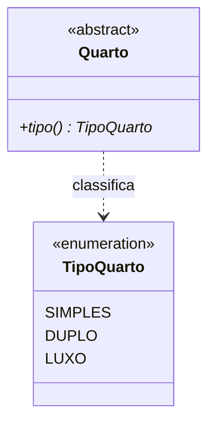
```mermaid
classDiagram
    class TipoQuarto {
        <<enumeration>>
        SIMPLES
        DUPLO
        LUXO
    }

    class Quarto {
        <<abstract>>
        +tipo() TipoQuarto*
    }

    Quarto ..> TipoQuarto : classifica
```

#### Enum `StatusQuarto`
Controla os estados operacionais e de disponibilidade física de um quarto.

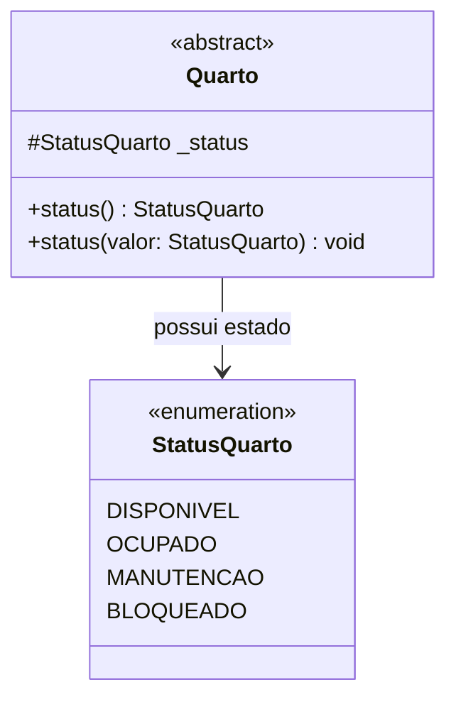
```mermaid
classDiagram
    class StatusQuarto {
        <<enumeration>>
        DISPONIVEL
        OCUPADO
        MANUTENCAO
        BLOQUEADO
    }

    class Quarto {
        <<abstract>>
        #StatusQuarto _status
        +status() StatusQuarto
        +status(valor: StatusQuarto) void
    }

    Quarto --> StatusQuarto : possui estado
```

#### Enum `StatusReserva`
Define os estados válidos do ciclo de vida de uma reserva.

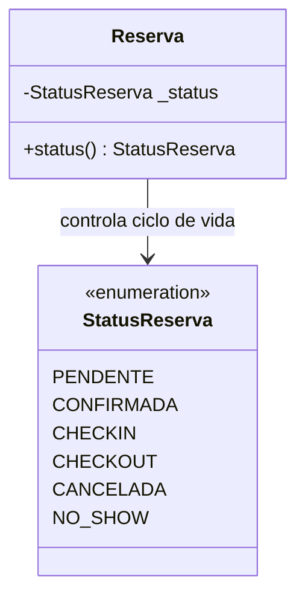
```mermaid
classDiagram
    class StatusReserva {
        <<enumeration>>
        PENDENTE
        CONFIRMADA
        CHECKIN
        CHECKOUT
        CANCELADA
        NO_SHOW
    }

    class Reserva {
        -StatusReserva _status
        +status() StatusReserva
    }

    Reserva --> StatusReserva : controla ciclo de vida
```

#### Enum `OrigemReserva`
Identifica o canal de aquisição pelo qual a reserva foi efetuada.

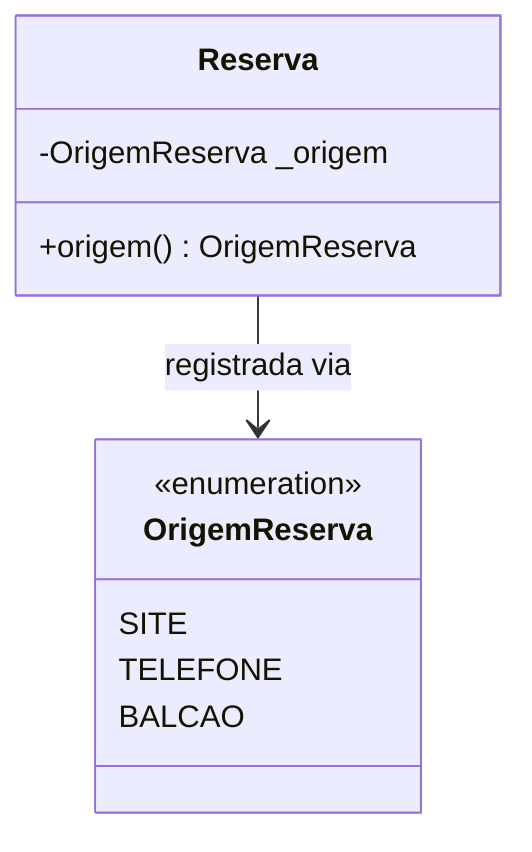
```mermaid
classDiagram
    class OrigemReserva {
        <<enumeration>>
        SITE
        TELEFONE
        BALCAO
    }

    class Reserva {
        -OrigemReserva _origem
        +origem() OrigemReserva
    }

    Reserva --> OrigemReserva : registrada via
```

#### Enum `MetodoPagamento`
Tipifica a modalidade financeira utilizada em cada pagamento lançado na reserva.

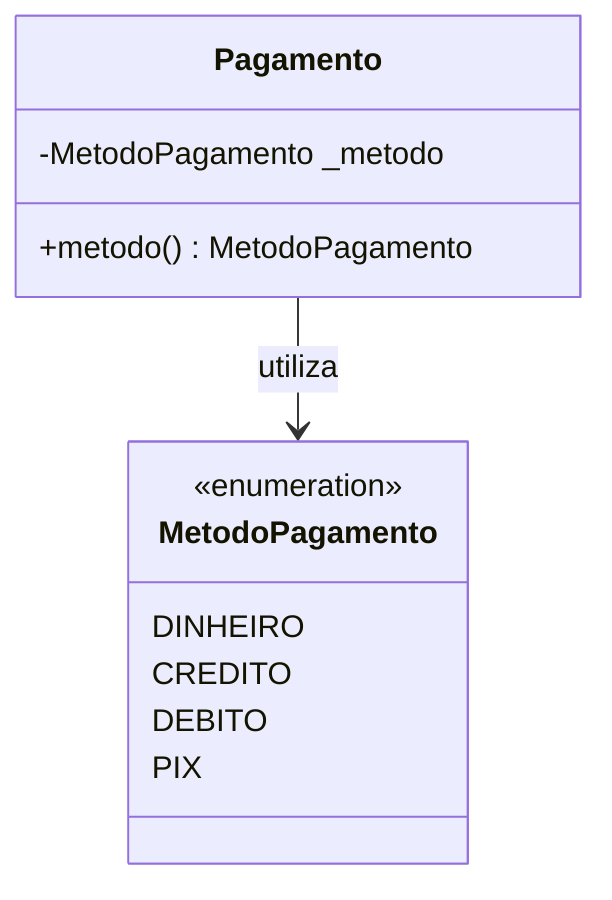
```mermaid
classDiagram
    class MetodoPagamento {
        <<enumeration>>
        DINHEIRO
        CREDITO
        DEBITO
        PIX
    }

    class Pagamento {
        -MetodoPagamento _metodo
        +metodo() MetodoPagamento
    }

    Pagamento --> MetodoPagamento : utiliza
```

---

### 1.2. Comportamentos Transversais (`src/models/mixins.py`)

#### Classe `AuditoriaMixin`
Fornece rastreabilidade temporal de criação e última modificação para entidades críticas via herança múltipla.

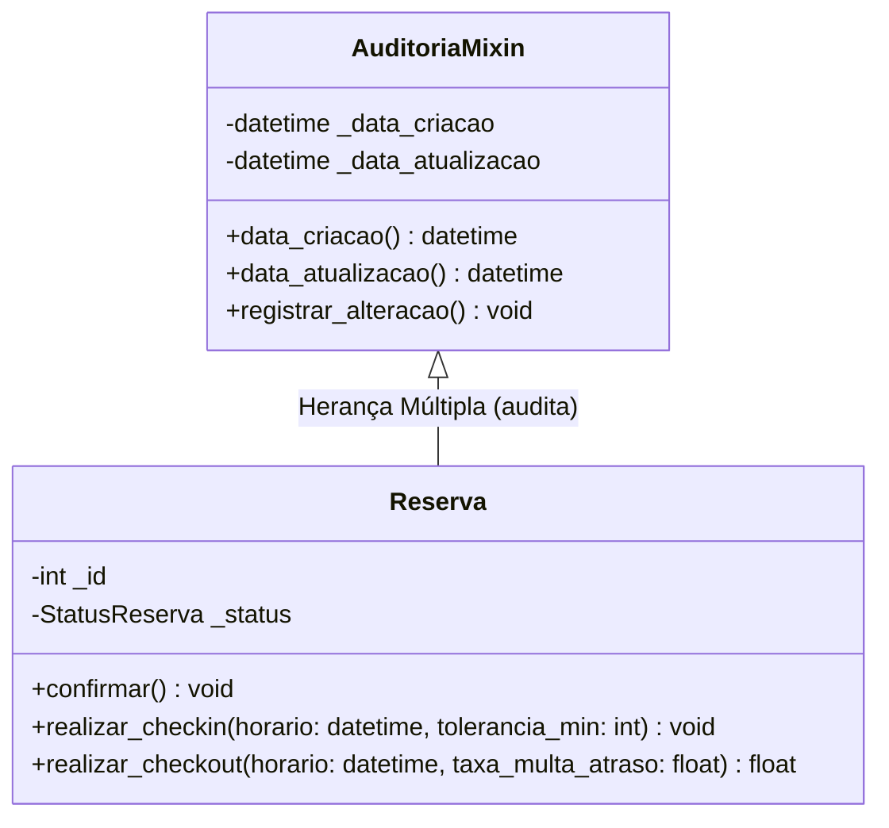
```mermaid
classDiagram
    %% Definição das Classes
    class AuditoriaMixin {
        -datetime _data_criacao
        -datetime _data_atualizacao
        +data_criacao() datetime
        +data_atualizacao() datetime
        +registrar_alteracao() void
    }

    class Reserva {
        -int _id
        -StatusReserva _status
        +confirmar() void
        +realizar_checkin(horario: datetime, tolerancia_min: int) void
        +realizar_checkout(horario: datetime, taxa_multa_atraso: float) float
    }

    %% Relações de Herança
    AuditoriaMixin <|-- Reserva : Herança Múltipla (audita)
```

#### Classe `SerializavelMixin`
Provê métodos padronizados de conversão de objetos de domínio para dicionários e JSON, facilitando a integração com persistência e API.

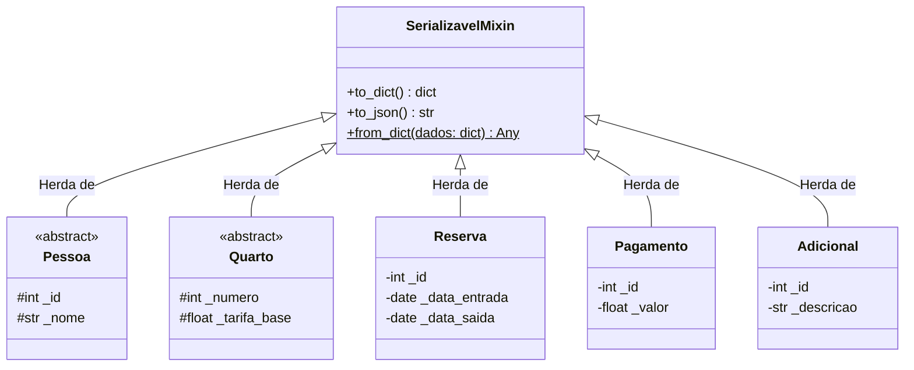
```mermaid
classDiagram
    %% Definição das Classes
    class SerializavelMixin {
        +to_dict() dict
        +to_json() str
        +from_dict(dados: dict)$ Any
    }

    class Pessoa {
        <<abstract>>
        #int _id
        #str _nome
    }

    class Quarto {
        <<abstract>>
        #int _numero
        #float _tarifa_base
    }

    class Reserva {
        -int _id
        -date _data_entrada
        -date _data_saida
    }

    class Pagamento {
        -int _id
        -float _valor
    }

    class Adicional {
        -int _id
        -str _descricao
    }

    %% Relações de Herança
    SerializavelMixin <|-- Pessoa : Herda de
    SerializavelMixin <|-- Quarto : Herda de
    SerializavelMixin <|-- Reserva : Herda de
    SerializavelMixin <|-- Pagamento : Herda de
    SerializavelMixin <|-- Adicional : Herda de
```

---

### 1.3. Hierarquia de Pessoas (`src/models/pessoa.py`)

#### Classe `Pessoa`
Classe base abstrata que encapsula os dados cadastrais e de identificação pessoal comuns no sistema.

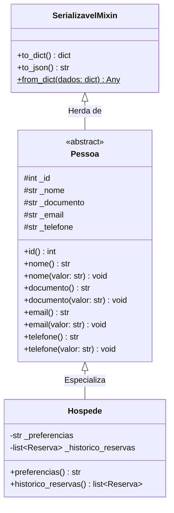
```mermaid
classDiagram
    %% Definição das Classes
    class SerializavelMixin {
        +to_dict() dict
        +to_json() str
        +from_dict(dados: dict)$ Any
    }

    class Pessoa {
        <<abstract>>
        #int _id
        #str _nome
        #str _documento
        #str _email
        #str _telefone
        +id() int
        +nome() str
        +nome(valor: str) void
        +documento() str
        +documento(valor: str) void
        +email() str
        +email(valor: str) void
        +telefone() str
        +telefone(valor: str) void
    }

    class Hospede {
        -str _preferencias
        -list~Reserva~ _historico_reservas
        +preferencias() str
        +historico_reservas() list~Reserva~
    }

    %% Relações de Herança
    SerializavelMixin <|-- Pessoa : Herda de
    Pessoa <|-- Hospede : Especializa
```

#### Classe `Hospede`
Especialização concreta de `Pessoa` que representa o cliente do hotel, mantendo suas preferências de estadia e histórico de reservas associadas.

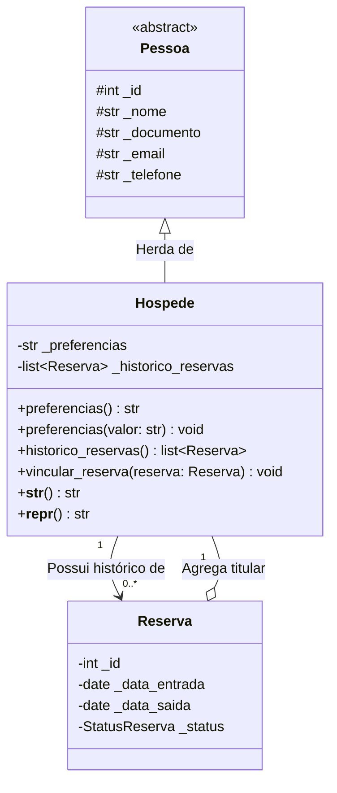
```mermaid
classDiagram
    %% Definição das Classes
    class Pessoa {
        <<abstract>>
        #int _id
        #str _nome
        #str _documento
        #str _email
        #str _telefone
    }

    class Hospede {
        -str _preferencias
        -list~Reserva~ _historico_reservas
        +preferencias() str
        +preferencias(valor: str) void
        +historico_reservas() list~Reserva~
        +vincular_reserva(reserva: Reserva) void
        +__str__() str
        +__repr__() str
    }

    class Reserva {
        -int _id
        -date _data_entrada
        -date _data_saida
        -StatusReserva _status
    }

    %% Relações de Herança e Associação
    Pessoa <|-- Hospede : Herda de
    Hospede "1" --> "0..*" Reserva : Possui histórico de
    Reserva o-- "1" Hospede : Agrega titular
```

---

### 1.4. Hierarquia de Quartos (`src/models/quarto.py`)

#### Classe `Quarto`
Classe base abstrata que define a estrutura de uma acomodação, controle de manutenção, ordenação natural (`__lt__`) e contrato de cálculo polimórfico de diária.

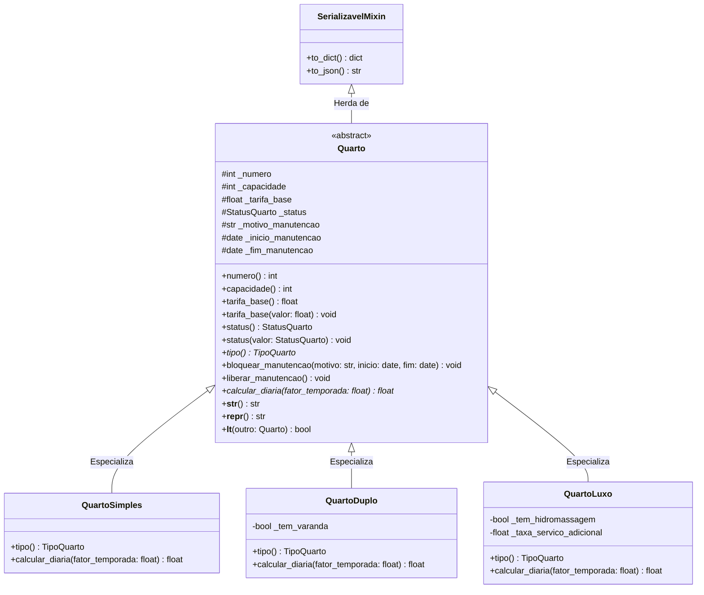
```mermaid
classDiagram
    %% Definição das Classes
    class SerializavelMixin {
        +to_dict() dict
        +to_json() str
    }

    class Quarto {
        <<abstract>>
        #int _numero
        #int _capacidade
        #float _tarifa_base
        #StatusQuarto _status
        #str _motivo_manutencao
        #date _inicio_manutencao
        #date _fim_manutencao
        +numero() int
        +capacidade() int
        +tarifa_base() float
        +tarifa_base(valor: float) void
        +status() StatusQuarto
        +status(valor: StatusQuarto) void
        +tipo() TipoQuarto*
        +bloquear_manutencao(motivo: str, inicio: date, fim: date) void
        +liberar_manutencao() void
        +calcular_diaria(fator_temporada: float)* float
        +__str__() str
        +__repr__() str
        +__lt__(outro: Quarto) bool
    }

    class QuartoSimples {
        +tipo() TipoQuarto
        +calcular_diaria(fator_temporada: float) float
    }

    class QuartoDuplo {
        -bool _tem_varanda
        +tipo() TipoQuarto
        +calcular_diaria(fator_temporada: float) float
    }

    class QuartoLuxo {
        -bool _tem_hidromassagem
        -float _taxa_servico_adicional
        +tipo() TipoQuarto
        +calcular_diaria(fator_temporada: float) float
    }

    %% Relações de Herança
    SerializavelMixin <|-- Quarto : Herda de
    Quarto <|-- QuartoSimples : Especializa
    Quarto <|-- QuartoDuplo : Especializa
    Quarto <|-- QuartoLuxo : Especializa
```

#### Classe `QuartoSimples`
Subclasse concreta para acomodações padrão individuais ou econômicas, aplicando o cálculo de diária sobre a tarifa base e o fator de temporada.

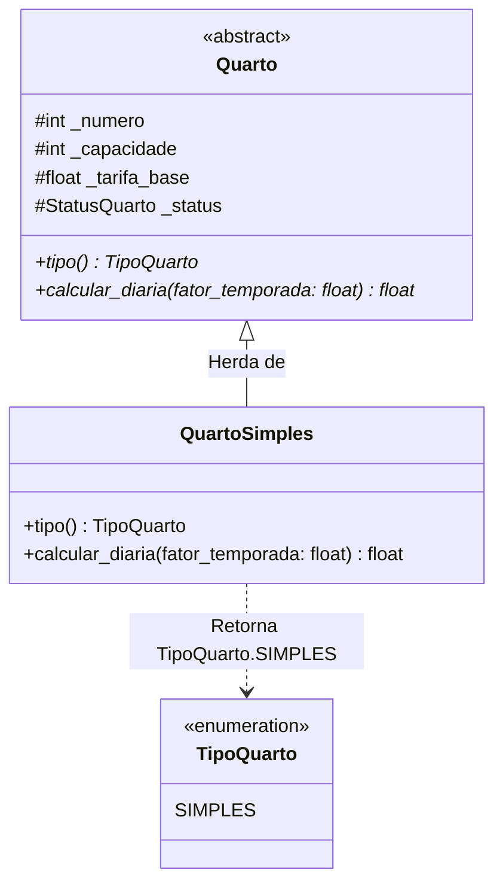
```mermaid
classDiagram
    %% Definição das Classes
    class Quarto {
        <<abstract>>
        #int _numero
        #int _capacidade
        #float _tarifa_base
        #StatusQuarto _status
        +tipo() TipoQuarto*
        +calcular_diaria(fator_temporada: float)* float
    }

    class QuartoSimples {
        +tipo() TipoQuarto
        +calcular_diaria(fator_temporada: float) float
    }

    class TipoQuarto {
        <<enumeration>>
        SIMPLES
    }

    %% Relações de Herança e Dependência
    Quarto <|-- QuartoSimples : Herda de
    QuartoSimples ..> TipoQuarto : Retorna TipoQuarto.SIMPLES
```

#### Classe `QuartoDuplo`
Subclasse concreta para acomodações duplas, adicionando controle de varanda e regra própria de precificação.

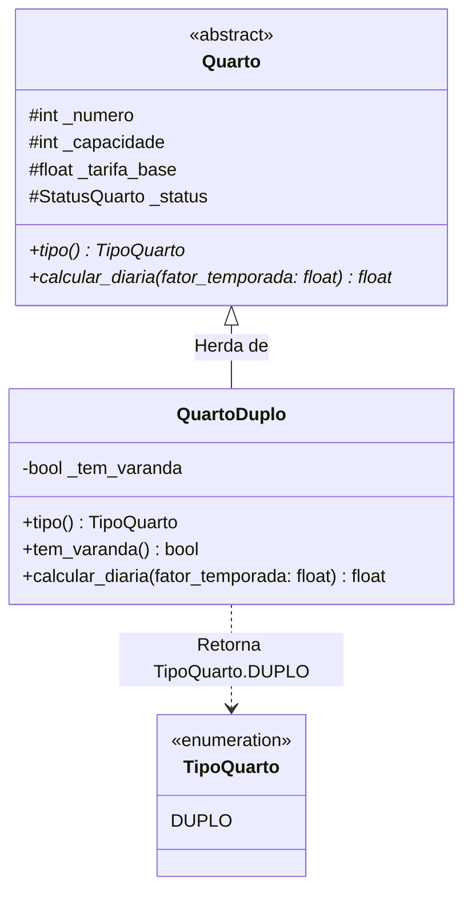
```mermaid
classDiagram
    %% Definição das Classes
    class Quarto {
        <<abstract>>
        #int _numero
        #int _capacidade
        #float _tarifa_base
        #StatusQuarto _status
        +tipo() TipoQuarto*
        +calcular_diaria(fator_temporada: float)* float
    }

    class QuartoDuplo {
        -bool _tem_varanda
        +tipo() TipoQuarto
        +tem_varanda() bool
        +calcular_diaria(fator_temporada: float) float
    }

    class TipoQuarto {
        <<enumeration>>
        DUPLO
    }

    %% Relações de Herança e Dependência
    Quarto <|-- QuartoDuplo : Herda de
    QuartoDuplo ..> TipoQuarto : Retorna TipoQuarto.DUPLO
```

#### Classe `QuartoLuxo`
Subclasse concreta para acomodações de alto padrão, incluindo hidromassagem e taxa de serviço adicional embutida no cálculo polimórfico da diária.

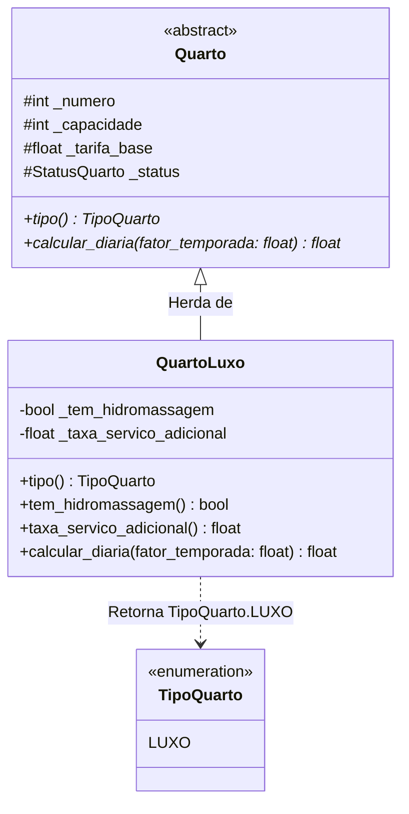
```mermaid
classDiagram
    %% Definição das Classes
    class Quarto {
        <<abstract>>
        #int _numero
        #int _capacidade
        #float _tarifa_base
        #StatusQuarto _status
        +tipo() TipoQuarto*
        +calcular_diaria(fator_temporada: float)* float
    }

    class QuartoLuxo {
        -bool _tem_hidromassagem
        -float _taxa_servico_adicional
        +tipo() TipoQuarto
        +tem_hidromassagem() bool
        +taxa_servico_adicional() float
        +calcular_diaria(fator_temporada: float) float
    }

    class TipoQuarto {
        <<enumeration>>
        LUXO
    }

    %% Relações de Herança e Dependência
    Quarto <|-- QuartoLuxo : Herda de
    QuartoLuxo ..> TipoQuarto : Retorna TipoQuarto.LUXO
```

---

### 1.5. Reservas, Pagamentos e Adicionais (`src/models/reserva.py`)

#### Classe `Reserva`
Entidade central do domínio que relaciona `Hospede` e `Quarto`, gerencia o ciclo de estados da hospedagem, compõe pagamentos e consumos adicionais, e implementa herança múltipla com `AuditoriaMixin` e `SerializavelMixin`.

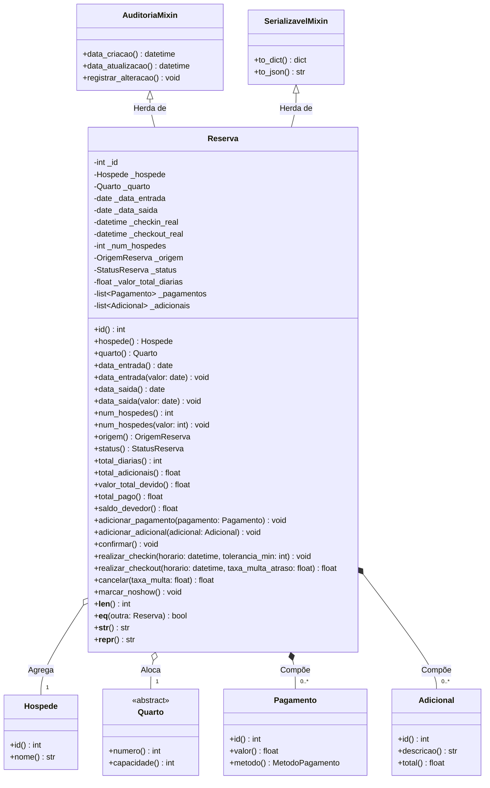
```mermaid
classDiagram
    %% Definição das Classes
    class AuditoriaMixin {
        +data_criacao() datetime
        +data_atualizacao() datetime
        +registrar_alteracao() void
    }

    class SerializavelMixin {
        +to_dict() dict
        +to_json() str
    }

    class Reserva {
        -int _id
        -Hospede _hospede
        -Quarto _quarto
        -date _data_entrada
        -date _data_saida
        -datetime _checkin_real
        -datetime _checkout_real
        -int _num_hospedes
        -OrigemReserva _origem
        -StatusReserva _status
        -float _valor_total_diarias
        -list~Pagamento~ _pagamentos
        -list~Adicional~ _adicionais
        +id() int
        +hospede() Hospede
        +quarto() Quarto
        +data_entrada() date
        +data_entrada(valor: date) void
        +data_saida() date
        +data_saida(valor: date) void
        +num_hospedes() int
        +num_hospedes(valor: int) void
        +origem() OrigemReserva
        +status() StatusReserva
        +total_diarias() int
        +total_adicionais() float
        +valor_total_devido() float
        +total_pago() float
        +saldo_devedor() float
        +adicionar_pagamento(pagamento: Pagamento) void
        +adicionar_adicional(adicional: Adicional) void
        +confirmar() void
        +realizar_checkin(horario: datetime, tolerancia_min: int) void
        +realizar_checkout(horario: datetime, taxa_multa_atraso: float) float
        +cancelar(taxa_multa: float) float
        +marcar_noshow() void
        +__len__() int
        +__eq__(outra: Reserva) bool
        +__str__() str
        +__repr__() str
    }

    class Hospede {
        +id() int
        +nome() str
    }

    class Quarto {
        <<abstract>>
        +numero() int
        +capacidade() int
    }

    class Pagamento {
        +id() int
        +valor() float
        +metodo() MetodoPagamento
    }

    class Adicional {
        +id() int
        +descricao() str
        +total() float
    }

    %% Relações de Herança, Agregação e Composição
    AuditoriaMixin <|-- Reserva : Herda de
    SerializavelMixin <|-- Reserva : Herda de
    Reserva o-- "1" Hospede : Agrega
    Reserva o-- "1" Quarto : Aloca
    Reserva *-- "0..*" Pagamento : Compõe
    Reserva *-- "0..*" Adicional : Compõe
```

#### Classe `Pagamento`
Representa uma transação financeira vinculada a uma reserva para abatimento do saldo devedor.

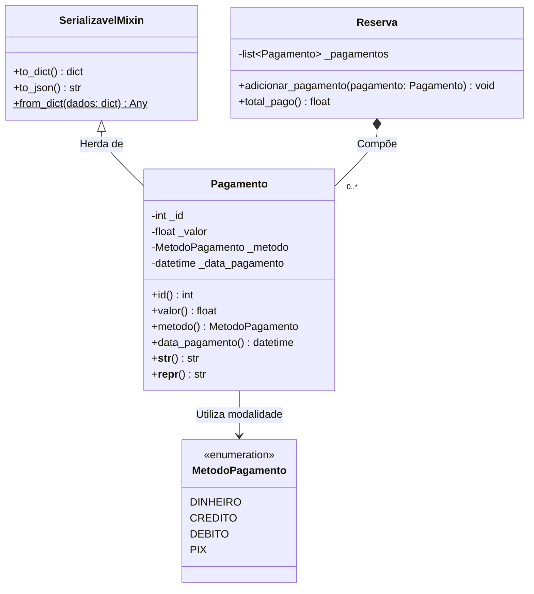
```mermaid
classDiagram
    %% Definição das Classes
    class SerializavelMixin {
        +to_dict() dict
        +to_json() str
        +from_dict(dados: dict)$ Any
    }

    class Pagamento {
        -int _id
        -float _valor
        -MetodoPagamento _metodo
        -datetime _data_pagamento
        +id() int
        +valor() float
        +metodo() MetodoPagamento
        +data_pagamento() datetime
        +__str__() str
        +__repr__() str
    }

    class Reserva {
        -list~Pagamento~ _pagamentos
        +adicionar_pagamento(pagamento: Pagamento) void
        +total_pago() float
    }

    class MetodoPagamento {
        <<enumeration>>
        DINHEIRO
        CREDITO
        DEBITO
        PIX
    }

    %% Relações de Herança, Composição e Associação
    SerializavelMixin <|-- Pagamento : Herda de
    Reserva *-- "0..*" Pagamento : Compõe
    Pagamento --> MetodoPagamento : Utiliza modalidade
```

#### Classe `Adicional`
Representa itens de consumo extra (frigobar, lavanderia, restaurante) lançados na conta da reserva durante a estadia.

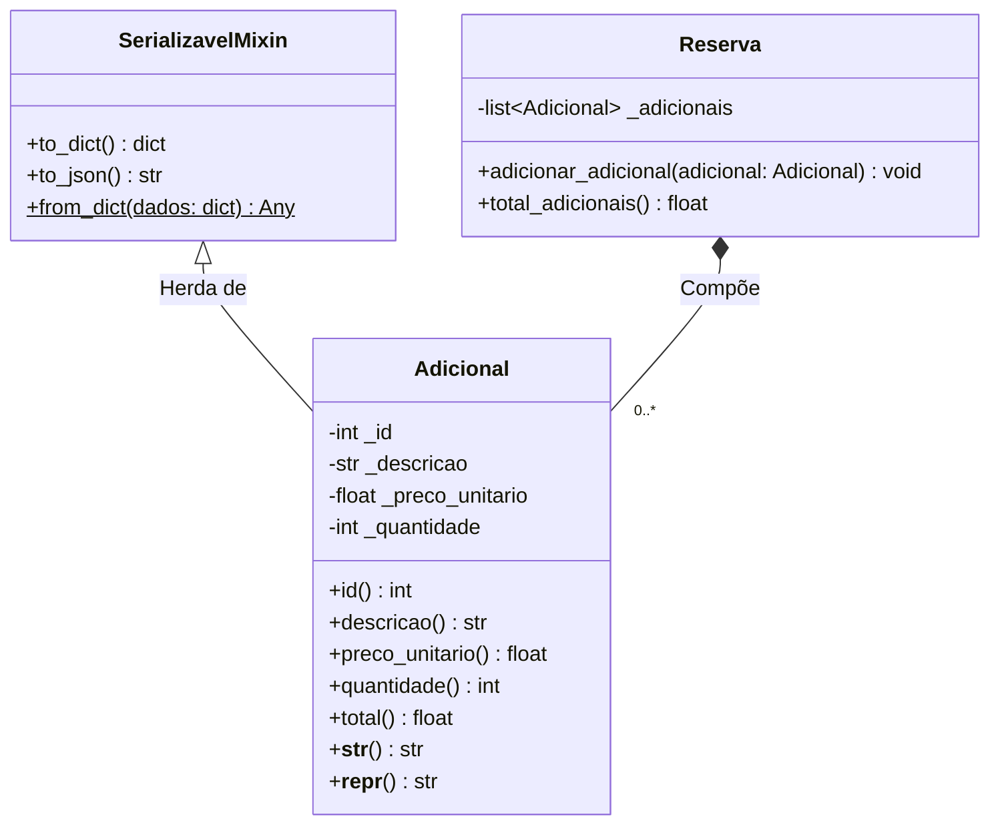
```mermaid
classDiagram
    %% Definição das Classes
    class SerializavelMixin {
        +to_dict() dict
        +to_json() str
        +from_dict(dados: dict)$ Any
    }

    class Adicional {
        -int _id
        -str _descricao
        -float _preco_unitario
        -int _quantidade
        +id() int
        +descricao() str
        +preco_unitario() float
        +quantidade() int
        +total() float
        +__str__() str
        +__repr__() str
    }

    class Reserva {
        -list~Adicional~ _adicionais
        +adicionar_adicional(adicional: Adicional) void
        +total_adicionais() float
    }

    %% Relações de Herança e Composição
    SerializavelMixin <|-- Adicional : Herda de
    Reserva *-- "0..*" Adicional : Compõe
```

---

### 1.6. Hierarquia de Exceções de Domínio (`src/models/exceptions.py`)

#### Classe `HotelException` e Subclasses
Hierarquia de exceções customizadas para tratamento explícito de violações de regras de negócio, impedindo estados inconsistentes, overbooking ou extrapolação de capacidade.

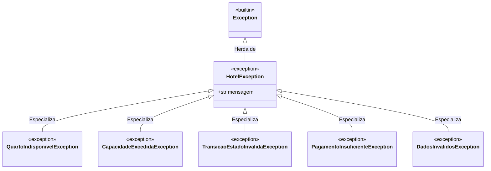
```mermaid
classDiagram
    %% Definição das Classes
    class Exception {
        <<builtin>>
    }

    class HotelException {
        <<exception>>
        +str mensagem
    }

    class QuartoIndisponivelException {
        <<exception>>
    }

    class CapacidadeExcedidaException {
        <<exception>>
    }

    class TransicaoEstadoInvalidaException {
        <<exception>>
    }

    class PagamentoInsuficienteException {
        <<exception>>
    }

    class DadosInvalidosException {
        <<exception>>
    }

    %% Relações de Herança
    Exception <|-- HotelException : Herda de
    HotelException <|-- QuartoIndisponivelException : Especializa
    HotelException <|-- CapacidadeExcedidaException : Especializa
    HotelException <|-- TransicaoEstadoInvalidaException : Especializa
    HotelException <|-- PagamentoInsuficienteException : Especializa
    HotelException <|-- DadosInvalidosException : Especializa
```

---

## 2. Bloco Temático: Services (`src/services/`)

Este bloco reúne as classes de serviço responsáveis pela orquestração de casos de uso, aplicação das políticas do arquivo `settings.json`, cálculos tarifários e consolidação de relatórios gerenciais.

---

### 2.1. Orquestração Central (`src/services/hotel.py`)

#### Classe `Hotel`
Orquestrador central da camada de serviços que coordena o acervo de quartos, cadastro de hóspedes, criação de reservas sem conflitos (prevenção de overbooking) e execução dos fluxos de check-in, check-out, cancelamento e no-show.

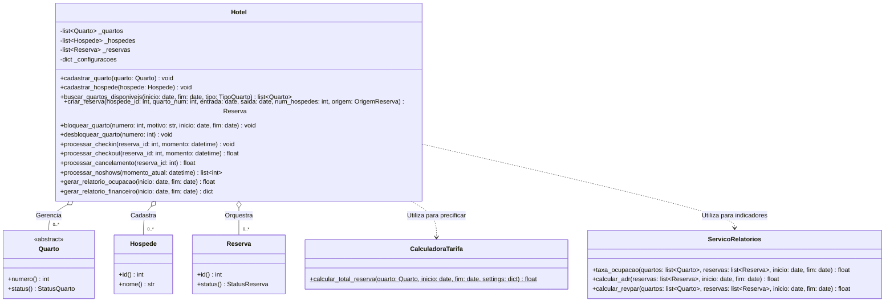
```mermaid
classDiagram
    %% Definição das Classes
    class Hotel {
        -list~Quarto~ _quartos
        -list~Hospede~ _hospedes
        -list~Reserva~ _reservas
        -dict _configuracoes
        +cadastrar_quarto(quarto: Quarto) void
        +cadastrar_hospede(hospede: Hospede) void
        +buscar_quartos_disponiveis(inicio: date, fim: date, tipo: TipoQuarto) list~Quarto~
        +criar_reserva(hospede_id: int, quarto_num: int, entrada: date, saida: date, num_hospedes: int, origem: OrigemReserva) Reserva
        +bloquear_quarto(numero: int, motivo: str, inicio: date, fim: date) void
        +desbloquear_quarto(numero: int) void
        +processar_checkin(reserva_id: int, momento: datetime) void
        +processar_checkout(reserva_id: int, momento: datetime) float
        +processar_cancelamento(reserva_id: int) float
        +processar_noshows(momento_atual: datetime) list~int~
        +gerar_relatorio_ocupacao(inicio: date, fim: date) float
        +gerar_relatorio_financeiro(inicio: date, fim: date) dict
    }

    class Quarto {
        <<abstract>>
        +numero() int
        +status() StatusQuarto
    }

    class Hospede {
        +id() int
        +nome() str
    }

    class Reserva {
        +id() int
        +status() StatusReserva
    }

    class CalculadoraTarifa {
        +calcular_total_reserva(quarto: Quarto, inicio: date, fim: date, settings: dict)$ float
    }

    class ServicoRelatorios {
        +taxa_ocupacao(quartos: list~Quarto~, reservas: list~Reserva~, inicio: date, fim: date) float
        +calcular_adr(reservas: list~Reserva~, inicio: date, fim: date) float
        +calcular_revpar(quartos: list~Quarto~, reservas: list~Reserva~, inicio: date, fim: date) float
    }

    %% Relações de Agregação e Dependência
    Hotel o-- "0..*" Quarto : Gerencia
    Hotel o-- "0..*" Hospede : Cadastra
    Hotel o-- "0..*" Reserva : Orquestra
    Hotel ..> CalculadoraTarifa : Utiliza para precificar
    Hotel ..> ServicoRelatorios : Utiliza para indicadores
```

---

### 2.2. Cálculo de Tarifas (`src/services/rates.py`)

#### Classe `CalculadoraTarifa`
Serviço utilitário composto por funções puras que calculam o valor das diárias aplicando multiplicadores de alta temporada e fins de semana parametrizados no `settings.json`.

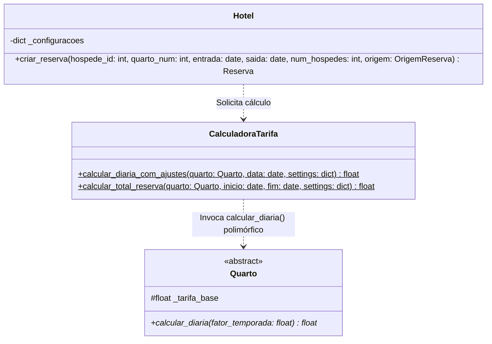
```mermaid
classDiagram
    %% Definição das Classes
    class CalculadoraTarifa {
        +calcular_diaria_com_ajustes(quarto: Quarto, data: date, settings: dict)$ float
        +calcular_total_reserva(quarto: Quarto, inicio: date, fim: date, settings: dict)$ float
    }

    class Quarto {
        <<abstract>>
        #float _tarifa_base
        +calcular_diaria(fator_temporada: float)* float
    }

    class Hotel {
        -dict _configuracoes
        +criar_reserva(hospede_id: int, quarto_num: int, entrada: date, saida: date, num_hospedes: int, origem: OrigemReserva) Reserva
    }

    %% Relações de Dependência
    Hotel ..> CalculadoraTarifa : Solicita cálculo
    CalculadoraTarifa ..> Quarto : Invoca calcular_diaria() polimórfico
```

---

### 2.3. Relatórios e Indicadores (`src/services/reports.py`)

#### Classe `ServicoRelatorios`
Serviço especializado na extração de métricas gerenciais de desempenho hoteleiro: Taxa de Ocupacao, ADR (*Average Daily Rate*), RevPAR (*Revenue per Available Room*), estatísticas de cancelamento e receita por categoria de quarto.

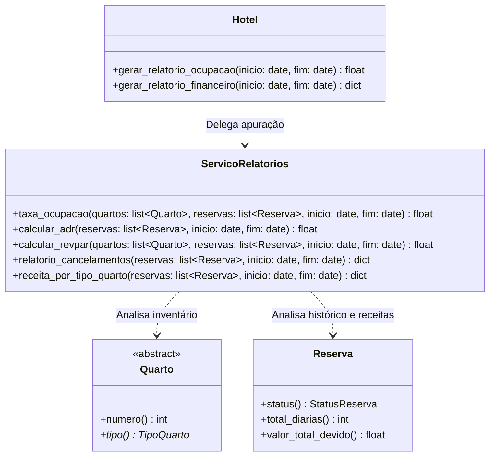
```mermaid
classDiagram
    %% Definição das Classes
    class ServicoRelatorios {
        +taxa_ocupacao(quartos: list~Quarto~, reservas: list~Reserva~, inicio: date, fim: date) float
        +calcular_adr(reservas: list~Reserva~, inicio: date, fim: date) float
        +calcular_revpar(quartos: list~Quarto~, reservas: list~Reserva~, inicio: date, fim: date) float
        +relatorio_cancelamentos(reservas: list~Reserva~, inicio: date, fim: date) dict
        +receita_por_tipo_quarto(reservas: list~Reserva~, inicio: date, fim: date) dict
    }

    class Hotel {
        +gerar_relatorio_ocupacao(inicio: date, fim: date) float
        +gerar_relatorio_financeiro(inicio: date, fim: date) dict
    }

    class Quarto {
        <<abstract>>
        +numero() int
        +tipo() TipoQuarto*
    }

    class Reserva {
        +status() StatusReserva
        +total_diarias() int
        +valor_total_devido() float
    }

    %% Relações de Dependência
    Hotel ..> ServicoRelatorios : Delega apuração
    ServicoRelatorios ..> Quarto : Analisa inventário
    ServicoRelatorios ..> Reserva : Analisa histórico e receitas
```

---

## 3. Diagramas Dinâmicos (UML Comportamental)

A rubrica avalia rigorosamente o controle de **estados válidos e transições controladas** (15 pts). Abaixo estão as máquinas de estados que governam o comportamento dinâmico do sistema.

### 3.1. Máquina de Estados da Reserva (`Reserva`)

```mermaid
stateDiagram-v2
    [*] --> PENDENTE: Criar Reserva (impede overbooking / valida capacidade)
    
    PENDENTE --> CONFIRMADA: Pagamento de sinal / Confirmação direta
    PENDENTE --> CANCELADA: Cancelar sem multa
    
    CONFIRMADA --> CHECKIN: Realizar Check-in (respeita janela e tolerância)
    CONFIRMADA --> CANCELADA: Cancelamento com multa (conforme settings.json)
    CONFIRMADA --> NO_SHOW: Tolerância expirada (libera o quarto)
    
    CHECKIN --> CHECKOUT: Realizar Check-out (valida: total_pago >= total_devido)
    
    CHECKOUT --> [*]
    CANCELADA --> [*]
    NO_SHOW --> [*]
```

### 3.2. Máquina de Estados do Quarto (`Quarto`)

```mermaid
stateDiagram-v2
    [*] --> DISPONIVEL: Cadastro do Quarto
    
    DISPONIVEL --> OCUPADO: Check-in realizado
    OCUPADO --> DISPONIVEL: Check-out finalizado
    
    DISPONIVEL --> MANUTENCAO: Bloqueio para manutenção (com motivo e período)
    MANUTENCAO --> DISPONIVEL: Conclusão da manutenção
    
    DISPONIVEL --> BLOQUEADO: Bloqueio administrativo
    BLOQUEADO --> DISPONIVEL: Desbloqueio
```

### 3.3. Diagrama de Sequência: Fluxo de Check-in com Validações

```mermaid
sequenceDiagram
    autonumber
    actor Cliente as Operador / API
    participant Hotel as Hotel (Service)
    participant Reserva as Reserva
    participant Quarto as Quarto

    Cliente->>Hotel: processar_checkin(reserva_id, horario_atual)
    Hotel->>Reserva: verificar_status()
    alt Status != CONFIRMADA
        Hotel-->>Cliente: Erro: TransicaoEstadoInvalidaException
    else Status == CONFIRMADA
        Hotel->>Reserva: realizar_checkin(horario_atual, tolerancia)
        Reserva->>Quarto: verificar status
        alt Quarto em MANUTENCAO ou BLOQUEADO
            Reserva-->>Hotel: Erro: QuartoIndisponivelException
            Hotel-->>Cliente: Erro de disponibilidade
        else Quarto DISPONIVEL
            Reserva->>Reserva: set status = CHECKIN, checkin_real = horario
            Reserva->>Quarto: set status = OCUPADO
            Reserva-->>Hotel: Check-in confirmado
            Hotel-->>Cliente: Sucesso (Status 200)
        end
    end
```

---

## 4. Especificação Textual dos Métodos Especiais e Encapsulamento

### 4.1. Métodos Especiais Exigidos pela Rubrica (≥ 4 métodos)
1. **`Quarto.__str__()` e `__repr__()`**:
   * Fornecem representação textual amigável e técnica do quarto, incluindo número, tipo, capacidade e status.
2. **`Quarto.__lt__(outro: Quarto) -> bool`**:
   * Implementa a ordenação natural dos quartos conforme a especificação oficial: primeiro por **tipo de quarto** (hierarquia/luxo) e, em caso de empate, pelo **número do quarto**.
3. **`Reserva.__len__() -> int`**:
   * Retorna a quantidade exata de diárias contratadas: `(data_saida - data_entrada).days`.
4. **`Reserva.__eq__(outra: Reserva) -> bool`**:
   * Implementa a igualdade estrita exigida pela especificação: duas reservas são consideradas iguais se alocam o **mesmo quarto** e possuem **intervalo idêntico de datas** (`self._quarto == outra._quarto and self._data_entrada == outra._data_entrada and self._data_saida == outra._data_saida`).

### 4.2. Validações com `@property` e Encapsulamento
* **`Quarto`**:
  * `capacidade`: `@property` com validação de limite mínimo (`capacidade >= 1`).
  * `tarifa_base`: `@property` com validação de valor estritamente positivo (`tarifa_base > 0`).
  * `status`: `@property` com setter validando se o valor pertence a `StatusQuarto`.
* **`Reserva`**:
  * `data_entrada` e `data_saida`: `@property` garantindo `data_entrada < data_saida` (estadia mínima de 1 noite).
  * `num_hospedes`: `@property` validando que `1 <= num_hospedes <= quarto.capacidade`.
  * `saldo_devedor`: `@property` computada que calcula `valor_total_devido - total_pago`.
  * `status`: Impede transições ilegais diretamente, exigindo métodos de ciclo de vida (`confirmar()`, `realizar_checkin()`, `realizar_checkout()`, `cancelar()`, `marcar_noshow()`).

### 4.3. Regras de Negócio e Cálculos de Diária
* **`CalculadoraTarifa`**:
  * Funções puras que iteram dia a dia do período da reserva:
    * Se o dia cair em fim de semana (sábado/domingo), aplica o multiplicador de fim de semana (ex.: `1.1x` do `settings.json`).
    * Se o dia cair em período de alta temporada cadastrado, aplica o multiplicador de temporada (ex.: `1.3x`).
    * Multiplicadores cumulativos ou prioritários conforme configuração em `settings.json`.
* **Políticas de Cancelamento e No-Show**:
  * Cancelamento: Se cancelado com antecedência menor que o limite de horas (ex.: 48h), calcula multa proporcional às diárias.
  * No-show: Se o hóspede não comparecer até o limite de tolerância (ex.: 23:59 + minutos de tolerância), a reserva é transicionada para `NO_SHOW` e o quarto é liberado para `DISPONIVEL`.