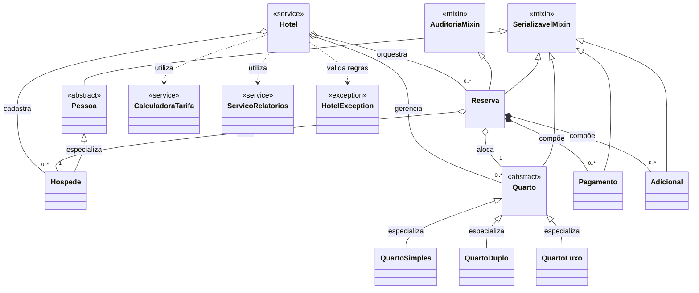

# 🏨 Sistema de Reservas de Hotel 

> **Instituição:** Universidade Federal do Cariri (UFCA) — Centro de Ciências e Tecnologia (CCT)  
> **Curso:** Bacharelado em Engenharia de Software  
> **Disciplina:** Programação Orientada a Objetos (Projeto 1 - Tema 8)  

---

## 📌 Sumário

1. [Descrição do Projeto](#1-descrição-do-projeto)
2. [Objetivos e Finalidade](#2-objetivos-e-finalidade)
3. [Modelagem UML (Visão Geral)](#3-modelagem-uml-visão-geral)
4. [Arquitetura e Estrutura de Diretórios](#4-arquitetura-e-estrutura-de-diretórios)
5. [Instalação, Execução e Testes](#5-instalação-execução-e-testes)
6. [Cronograma de Entregas](#6-cronograma-de-entregas)

---

## 1. Descrição do Projeto

O **Sistema de Reservas de Hotel** informatiza a operação e a gestão financeira de um estabelecimento hoteleiro utilizando modelagem orientada a objetos em Python. O software gerencia o cadastro de acomodações (**Simples**, **Duplo** e **Luxo**) e de hóspedes, controlando todo o ciclo de vida das reservas, *check-in*, *check-out*, lançamentos de consumos adicionais, pagamentos e bloqueios de quartos para manutenção.

O domínio da aplicação impede *overbooking* e extrapolação da capacidade física dos quartos, calcula diárias dinâmicas baseadas em temporadas e fins de semana (parametrizadas via `settings.json`) e processa cancelamentos com cálculo de multas e registros de *no-show*. A persistência de dados é realizada de forma desacoplada em banco relacional **SQLite**, e os serviços são disponibilizados através de uma API REST construída com **FastAPI**, preparada para integração direta com aplicativos móveis desenvolvidos no **MIT App Inventor**.

---

## 2. Objetivos e Finalidade

### 🎯 Objetivo Geral
Automatizar o fluxo operacional e financeiro hoteleiro, garantindo a integridade dos dados, o controle rigoroso das transições de estado das reservas (`PENDENTE`, `CONFIRMADA`, `CHECKIN`, `CHECKOUT`, `CANCELADA` e `NO_SHOW`) e a apuração de indicadores gerenciais de desempenho:
* **Taxa de Ocupação (%)**
* **ADR (*Average Daily Rate*)** — Diária Média
* **RevPAR (*Revenue per Available Room*)** — Receita por Quarto Disponível

### ⚙️ Objetivos Técnicos de POO
* **Herança Simples e Polimorfismo:** Especialização nas hierarquias `Pessoa` $\rightarrow$ `Hospede` e `Quarto` $\rightarrow$ `QuartoSimples`, `QuartoDuplo` e `QuartoLuxo`, com cálculo polimórfico de tarifas diárias.
* **Herança Múltipla via Mixins:** Reuso transversal de comportamentos com `AuditoriaMixin` (rastreio temporal de criação e atualização) e `SerializavelMixin` (conversão padronizada para dicionários e JSON).
* **Composição e Agregação:** Relacionamento estrutural em `Reserva`, agregando `Hospede` e `Quarto` e compondo listas de objetos `Pagamento` e `Adicional`.
* **Encapsulamento e Tratamento de Erros:** Proteção de atributos e validação de invariantes com `@property`, aliada a uma hierarquia de exceções customizadas de domínio (`HotelException` e subclasses).
* **Métodos Especiais (*Dunder Methods*):** Implementação de `__str__` e `__repr__` (representação textual), `__lt__` (ordenação natural de quartos por categoria e número), `__len__` (quantidade de diárias da reserva) e `__eq__` (detecção de conflito de quarto e período).
* **Persistência e Qualidade:** Armazenamento relacional estruturado com `sqlite3` e suíte de testes automatizados com `pytest`.

---

## 3. Modelagem UML (Visão Geral)

Abaixo encontra-se uma representação simplificada da arquitetura de classes do domínio e da camada de serviços, destacando as relações de herança, composição, agregação e dependência:



> 📄 **Documentação Completa dos Diagramas:**  
> Para visualizar os **diagramas individuais detalhados de cada classe** (com todos os atributos, `@property`, tipagens e métodos especiais), além das **Máquinas de Estado** e **Diagramas de Sequência**, acesse a especificação completa no repositório:  
> 👉 **[Especificação UML Completa (`docs/uml_diagram.md`)](./docs/uml_diagram.md)**  
> 👉 **[Regras de Negócio e Políticas (`docs/business_rules.md`)](./docs/business_rules.md)**  
> 👉 **[Guia da API para App Inventor (`docs/api_mobile_guide.md`)](./docs/api_mobile_guide.md)**

---

## 4. Arquitetura e Estrutura de Diretórios

O projeto adota uma arquitetura modular em camadas, isolando as entidades de negócio (`src/models/`) das regras de orquestração (`src/services/`), da persistência em banco de dados (`src/database/`) e da interface HTTP (`src/api/`):

```text
sistema-reservas-hotel/          <-- Raiz do repositório
│
├── README.md                    <-- Documentação principal e visão geral do projeto
├── settings.json                <-- Parâmetros configuráveis (horários, temporadas, multas)
├── requirements.txt             <-- Dependências externas (fastapi, uvicorn, pytest)
├── .gitignore                   <-- Arquivos ignorados pelo versionamento Git
│
├── docs/                        <-- 📁 PASTA DE DOCUMENTAÇÃO
│   ├── uml_diagram.md           <-- Especificação detalhada do Diagrama de Classes (Mermaid)
│   ├── business_rules.md        <-- Detalhamento das políticas de tarifas, estados e multas
│   └── api_mobile_guide.md      <-- Documentação das rotas HTTP para integração (App Inventor)
│
├── src/                         <-- 📁 PACOTE PRINCIPAL DO CÓDIGO-FONTE
│   ├── __init__.py
│   │
│   ├── models/                  <-- 📁 CAMADA DE DOMÍNIO (Classes POO, Herança e Mixins)
│   │   ├── __init__.py
│   │   ├── enums.py             <-- Enumerações de estado e tipos (StatusReserva, TipoQuarto, etc.)
│   │   ├── exceptions.py        <-- Classes de Exceções Customizadas de domínio
│   │   ├── mixins.py            <-- Mixins de herança múltipla (AuditoriaMixin, SerializavelMixin)
│   │   ├── person.py            <-- Classes Pessoa (base abstrata) e Hospede
│   │   ├── room.py              <-- Classes Quarto (base), QuartoSimples, QuartoDuplo, QuartoLuxo
│   │   ├── payment.py           <-- Classes financeiras e de consumo (Pagamento e Adicional)
│   │   └── reservation.py       <-- Classe central Reserva (ciclo de vida, datas e composições)
│   │
│   ├── services/                <-- 📁 CAMADA DE REGRAS DE NEGÓCIO E SERVIÇOS
│   │   ├── __init__.py
│   │   ├── hotel.py             <-- Classe Orquestradora (controle de overbooking, check-in/out)
│   │   ├── rates.py             <-- Funções puras de cálculo (temporadas, fim de semana, multas)
│   │   └── reports.py           <-- Motor de indicadores gerenciais (Ocupação, ADR, RevPAR)
│   │
│   ├── database/                <-- 📁 CAMADA DE PERSISTÊNCIA E DADOS (SQLite)
│   │   ├── __init__.py
│   │   ├── connection.py        <-- Gestão de conexão com sqlite3 e inicialização do banco
│   │   ├── schema.sql           <-- Script DDL (CREATE TABLE de quartos, hóspedes, reservas, etc.)
│   │   ├── data.py              <-- Operações de CRUD (salvar/carregar entidades do domínio)
│   │   └── seed.py              <-- Rotina de carga inicial (6-8 quartos e 3 temporadas)
│   │
│   └── api/                     <-- 📁 CAMADA DE INTERFACE E COMUNICAÇÃO (FastAPI)
│       ├── __init__.py
│       ├── app.py               <-- Instância principal e configuração do servidor FastAPI
│       ├── routes.py            <-- Definição dos endpoints HTTP (quartos, reservas, relatórios)
│       └── schemas.py           <-- Modelos Pydantic de validação de entrada/saída (JSON)
│
└── tests/                       <-- 📁 CAMADA DE TESTES AUTOMATIZADOS (pytest)
    ├── __init__.py
    ├── test_models.py           <-- Testes de criação de objetos, @property e métodos especiais
    ├── test_rules.py            <-- Testes de disponibilidade, capacidade, multas e no-show
    └── test_reports.py          <-- Testes de precisão dos cálculos de ADR, RevPAR e Ocupação
```

---

## 5. Instalação, Execução e Testes
## pendente...

---

## 6. Cronograma de Entregas

| Etapa | Data Limite | Tag Git | Escopo Principal |
| :--- | :---: | :---: | :--- |
| **Semana 1** | 29/09/2026 | `entrega1` | Modelagem UML, `README.md` inicial e esqueleto das classes com *docstrings*. |
| **Semana 2** | 06/10/2026 | `entrega2` | Implementação de `Quarto`, `Hospede` e `Reserva` com `@property`, métodos especiais e testes básicos. |
| **Semana 3** | 13/10/2026 | `entrega3` | Herança, associações com `Pagamento` e `Adicional`, persistência SQLite e relatório inicial de ocupação. |
| **Semana 4** | 27/10/2026 | `entrega4` | Fluxos de *check-in/out*, cancelamento com multa, *no-show*, tarifas por temporada, manutenção e API FastAPI. |
| **Semana 5** | 03/11/2026 | `v1.0` | Relatórios consolidados (ADR, RevPAR, Ocupação e Cancelamentos), documentação final e cobertura de testes. |